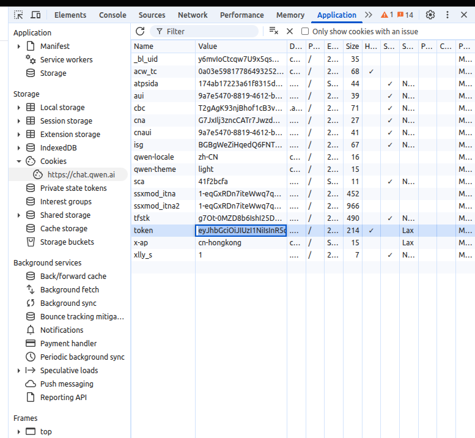
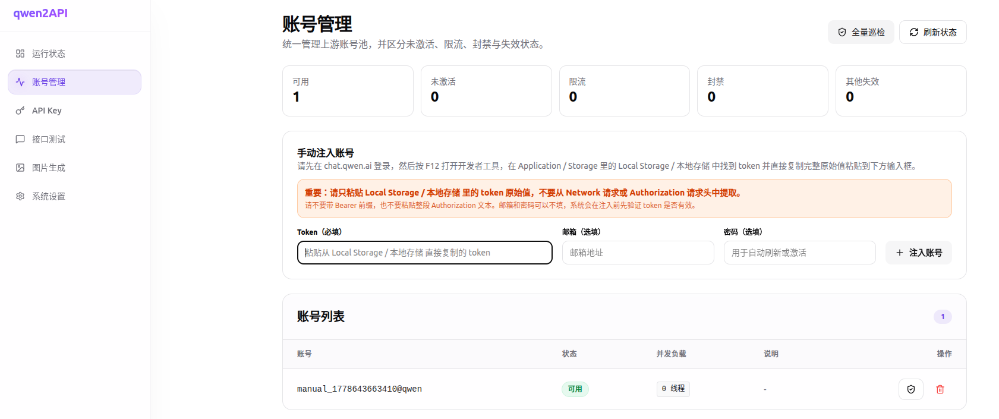

[toc]

## 1. 环境配置

复制默认环境变量文件并根据需要修改：

```bash
cp .env.default .env
```

**关键配置项说明：**

| 变量 | 默认值 | 说明 |
|------|--------|------|
| `ADMIN_KEY` | `admin` | 管理台登录密钥，**必须修改为强密码** |
| `PORT` | `7860` | 服务监听端口 |
| `WORKERS` | `1` | Worker 数量，**必须保持 1**（多 worker 会导致数据文件冲突） |
| `ENGINE_MODE` | `hybrid` | 引擎模式：`hybrid`（推荐）/ `httpx` / `browser` |
| `MAX_INFLIGHT` | `2` | 每账号最大并发请求数 |
| `ACCOUNT_MIN_INTERVAL_MS` | `1200` | 同账号两次请求最小间隔（毫秒） |
| `REQUEST_JITTER_MIN_MS` | `120` | 请求前随机抖动最小值（毫秒） |
| `REQUEST_JITTER_MAX_MS` | `360` | 请求前随机抖动最大值（毫秒） |
| `RATE_LIMIT_BASE_COOLDOWN` | `600` | 限流基础冷却时间（秒） |
| `RATE_LIMIT_MAX_COOLDOWN` | `3600` | 限流最大冷却时间（秒） |

---

## 2. 容器启动

### 2.1 修改镜像地址

当前 `docker-compose.yml` 已配置为本地私有镜像：

```yaml
image: docker.1ms.run/yujunzhixue/qwen2api:latest
```

如需使用 Docker Hub 官方镜像，改为：

```yaml
image: yujunzhixue/qwen2api:latest
```

### 2.2 启动服务

```bash
docker compose up -d
```

### 2.3 访问地址

服务默认监听 `0.0.0.0:7860`，支持以下地址访问：

| 地址 | 用途 |
|------|------|
| `http://127.0.0.1:7860` | 本机访问 |


> 端口映射 `"7860:7860"` 默认绑定 `0.0.0.0`，本机 IP 和局域网 IP 均可访问。
> 如 7860 端口被占用，可修改为 `"8080:7860"`。

### 2.4 常用命令

```bash
# 查看状态
docker compose ps

# 查看日志
docker compose logs -f

# 健康检查
curl http://127.0.0.1:7860/healthz

# 更新服务
docker compose pull && docker compose up -d

# 重启服务
docker compose restart
```

---

## 3. 获取千问 Token

访问 https://chat.qwen.ai/ 并登录，获取 Token 用于添加账号。



### 方法一：通过浏览器开发者工具（推荐）

**步骤 1：打开开发者工具**

在 Chrome / Edge / Firefox 中打开 https://chat.qwen.ai，按 `F12` 或右键 → 检查（Inspect）

**步骤 2：查看存储中的 Token**

Chrome / Edge → **Application** 标签：

```
Application
  → Storage
    → Cookies → https://chat.qwen.ai       ← 查找: token / auth / session
    → Local Storage → https://chat.qwen.ai  ← 查找: token / accessToken
    → Session Storage → https://chat.qwen.ai
```

Firefox → **Storage** 标签：

```
Storage
  → Cookies / Local Storage / Session Storage
```

### 方法二：通过网络请求抓取

在开发者工具的 **Network** 标签中，筛选请求 URL 包含 `chat.qwen.ai` 的请求，在请求头中查找 `Authorization: Bearer xxx` 或 Cookie 中的 Token 字段。

---

## 4. 添加账号

打开管理台 `http://127.0.0.1:7860/`，使用 `ADMIN_KEY` 登录后进入「账号管理」页面，点击添加账号。



将第 3 步获取的 Token 填入即可。添加后可点击「测试」按钮验证账号是否可用。

---

## 5. 管理 API Key

在管理台「API Key」页面创建下游调用密钥，供客户端使用。

---

## 6. 客户端接入示例

### OpenAI SDK

```python
from openai import OpenAI

client = OpenAI(
    base_url="http://127.0.0.1:7860/v1",
    api_key="YOUR_API_KEY",
)

resp = client.chat.completions.create(
    model="gpt-4o",
    messages=[{"role": "user", "content": "你好"}],
)
print(resp.choices[0].message.content)
```

### Anthropic SDK（Claude Code）

```python
from anthropic import Anthropic

client = Anthropic(
    base_url="http://127.0.0.1:7860/anthropic",
    api_key="YOUR_API_KEY",
)

resp = client.messages.create(
    model="claude-sonnet-4-6",
    max_tokens=1024,
    messages=[{"role": "user", "content": "你好"}],
)
print(resp.content[0].text)
```

### Claude Code CLI

```bash
export ANTHROPIC_BASE_URL=http://127.0.0.1:7860/anthropic
export ANTHROPIC_API_KEY=YOUR_API_KEY
claude
```

### curl 测试

```bash
# OpenAI 风格
curl http://127.0.0.1:7860/v1/chat/completions \
  -H "Content-Type: application/json" \
  -H "Authorization: Bearer YOUR_API_KEY" \
  -d '{"model":"gpt-4o","messages":[{"role":"user","content":"你好"}]}'

# 健康检查
curl http://127.0.0.1:7860/healthz
```
